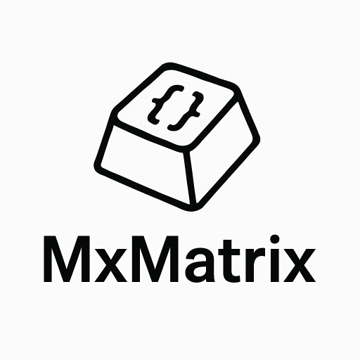
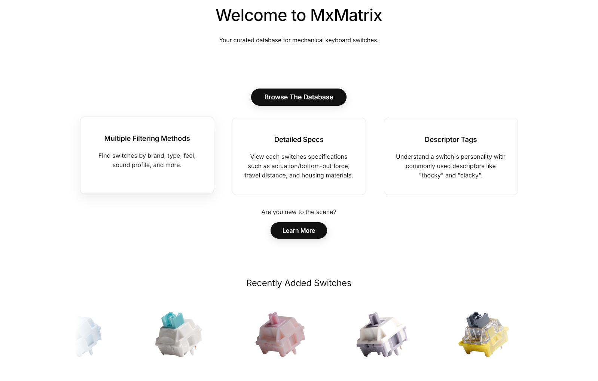
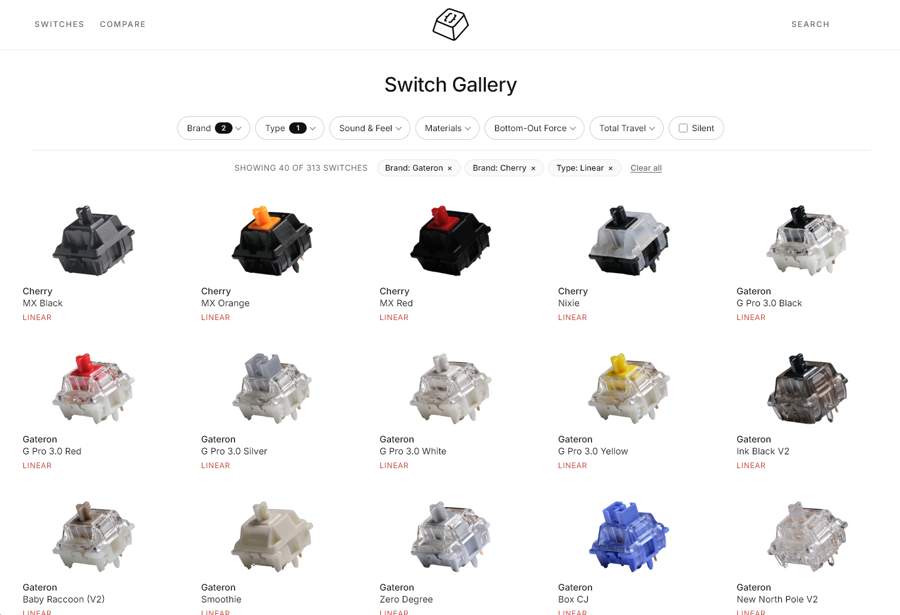
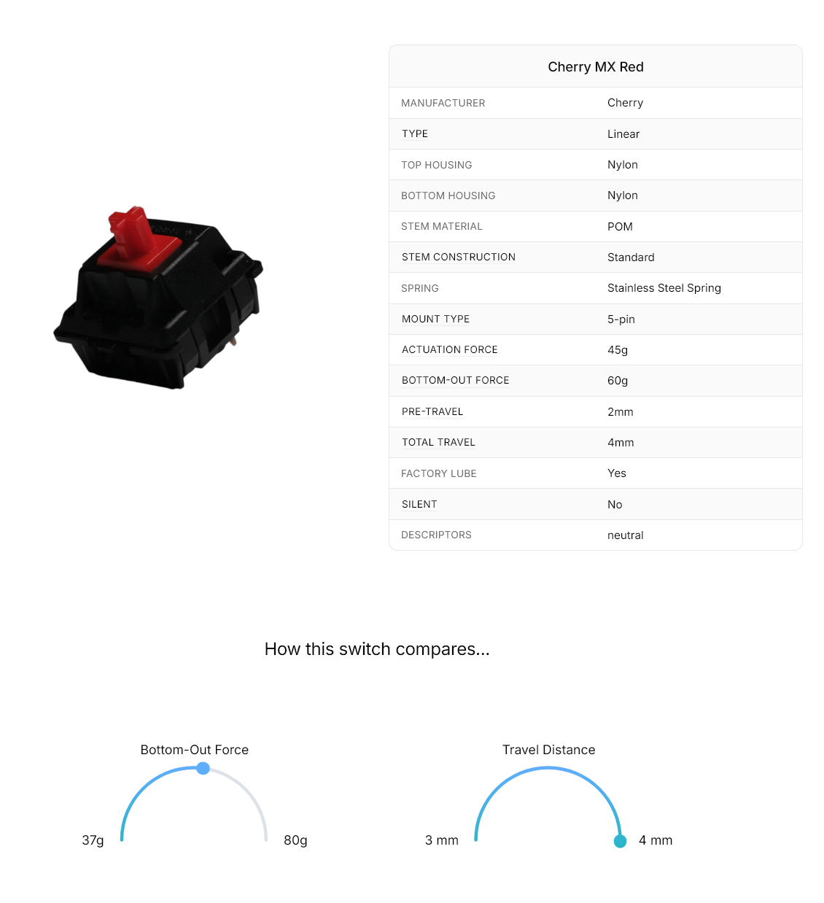
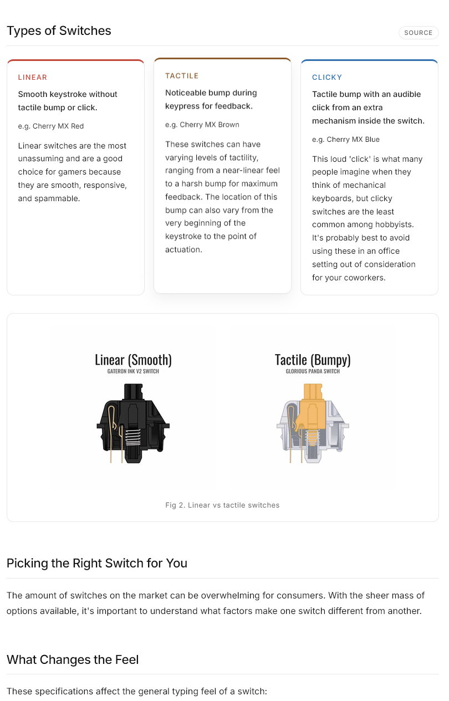

# MxMatrix ⌨️

MxMatrix is a web-based application designed for mechanical keyboard enthusiasts to explore, filter, and view detailed information about mechanical keyboard switches. Whether you're building a custom board or researching switch specs, MxMatrix makes it easy to find the right switch for your needs.

## 🔍 Features

- Clean, intuitive, and responsive user interface with image-based **switch gallery**.
    - Interactive, real-time, **filtering system** (by type, materials, sound, feel, and other specifications).
- Detailed **switch information pages**.
    - View all of a switches specs and see how it compares to other switches in the database.
- Informative 'Learn More' page to educate newcomers on what makes each switch unique.

## 🛠 Tech Stack Details

- **React.js** frontend
    - **React Router** for navigation
    - **useEffect Hooks** used for functionality 
    - **useState Hooks** used for managing state
- **CSS Modules** for component-specific styling
- **.NET** backend
    - **ASP.NET** RESTful API controllers
    - **Entity Framework Core** ORM for flexible query handling and database access

