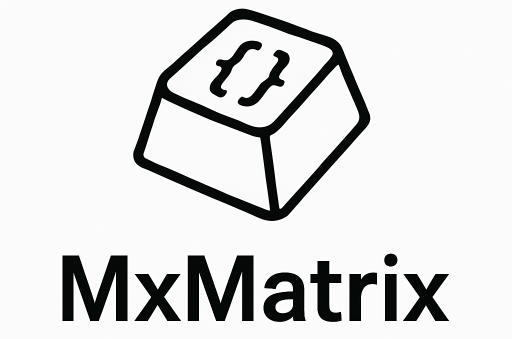
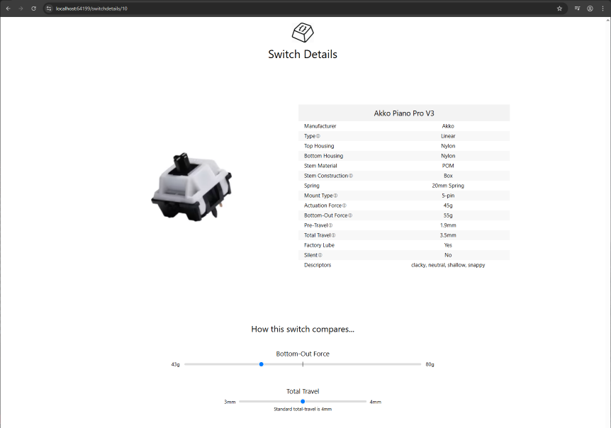

# MxMatrix 🧠⌨️

MxMatrix is a web-based application designed for mechanical keyboard enthusiasts to explore, filter, and view detailed information about mechanical keyboard switches. Whether you're building a custom board or researching switch specs, MxMatrix makes it easy to find the right switch for your needs.

---

## 🔍 Features

- Responsive **switch gallery** with image-based cards
- Interactive **filtering system** (by housing materials, stem, type, silent, etc.)
- Detailed **switch information pages**
- Expandable material filter with smart checkbox memory
- Intuitive and clean user interface

---

## 🛠 Tech Stack Details...

- **React.js** for the frontend
- **React Router** for navigation
- **JavaScript** for state and logic
- **CSS Modules** for component-specific styling
- **Entity Framework Core** ORM for database access

---

